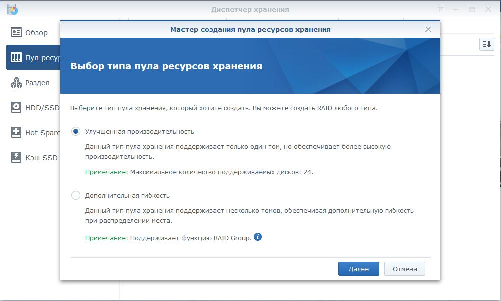
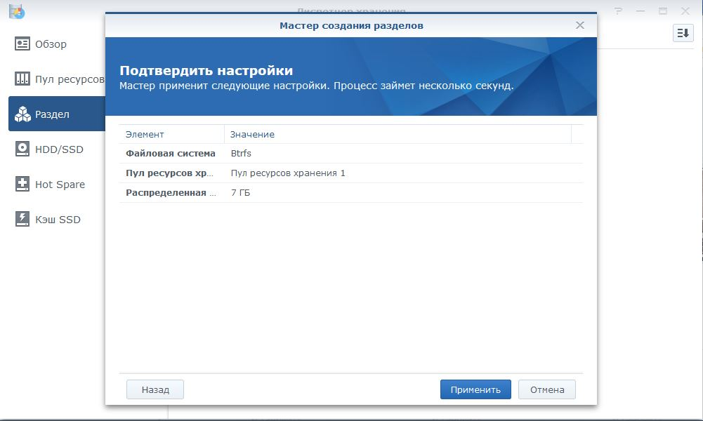

<h2>Настройка Synology DSM</h2>

Понадобится:

<ul>
    <li><a href="https://global.download.synology.com/download/DSM/release/6.2.3/25426/DSM_DS3615xs_25426.pat">DSM 6.2.3</a></li>
</ul>

Переходим <a href="https://find.synology.com/">https://find.synology.com/</a>

Если веб-версия не находит сервер, то нужно скачать Synology Assistant и проверить настройки сети.

Далее необходимо выбрать файл DSM_DS3615xs_25426.pat

Настройку QuickConnect можно пропустить.

Идем в Центр Пакетов

Как добавить адресные книги и контакты здесь.

