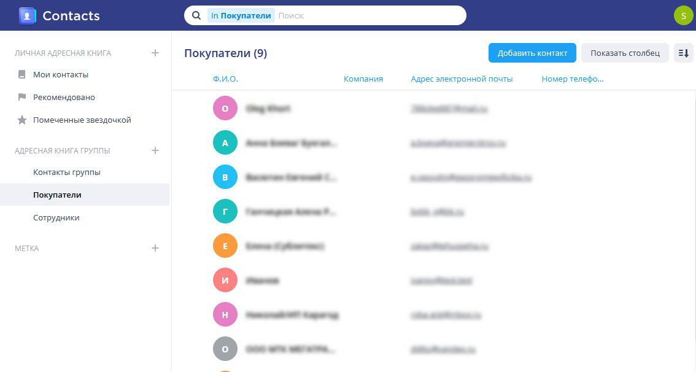

<h2>Добавление контактов и адресных книг</h2>

Открываем установленный пакет

Контакты можно добавить вручную

Можно импортировать несколько контактов

Рекомендую выбирать формат vcard вместо csv. CSV не всегда правильно 
определяет поля и может импортировать адресную книгу с пустыми данными.

Для дальнейшей работы с адресной книгой понадобится ее идентификатор 
(или хэш), который можно посмотреть нажам на CardDav

В настройки веб-приложения нужно будет переписать из данной строки 
необходимые параметры: ip-адрес, порт.

Идентификаторы адресных книг и параметры подобятся в следующем шаге

