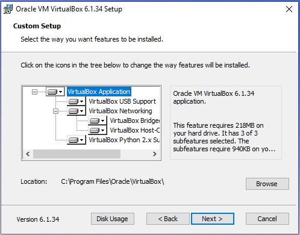

<h2>Установка VirtualBox</h2>

Cкачать можно с официального сайта 
<a href="https://www.virtualbox.org/wiki/Download_Old_Builds_6_1">https://www.virtualbox.org/wiki/Download_Old_Builds_6_1</a> 
Дальнейшяя инструкция показана на примере установки версии 6.1.34

<h2>Добавление и настройка виртуальной машины</h2>
<ul>
    <li>
        
    </li>
</ul>